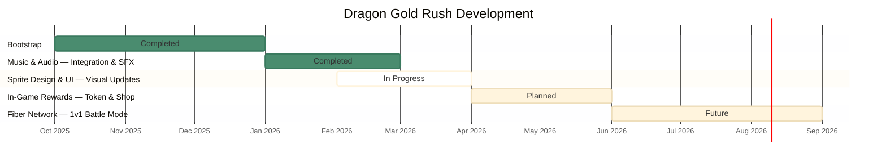

# Dragon Gold Rush — Roadmap

This roadmap tracks the major development milestones for Dragon Gold Rush. For detailed weekly progress, see the [Weekly Updates](WeeklyUpdates/).

**Last Updated:** 15 March 2026

### Status Legend

| Status | Meaning |
|--------|---------|
| **Completed** | Fully integrated and live |
| **In Progress** | Actively being worked on |
| **Planned** | Scoped and scheduled |
| **Future** | On the radar, not yet scheduled |

---

## Project Timeline

---

## Month 1 — Music & Audio ✅ Completed

- 7 original tracks by Mondrin (one half of [Tunnel Club](https://tunnelclub.bandcamp.com/)) integrated with per-theme playback
- Title screen music, crossfade transitions, special item SFX
- iOS audio compatibility, mute/options controls
- All planned music and audio work is fully integrated and live

## Month 1–2 — Sprite Design & UI Enhancements 🔄 In Progress

- **Completed:** Level restructure with new themed zones (sanctum, abyss, throne, summit) and background art
- **In Progress:** Sourcing artists for key visual updates — buttons, blocker items, and in-game UI elements
- **Target:** Initial visual updates by end of Month 2

## Post Month 2 — In-Game Rewards 📋 Planned

- Dragon Token integration
- In-game shop for special items
- Potential one-off original NFTs

## Future — Fiber Network Integration 🔮

- 1v1 battle mode via CKB Fiber Network (currently "Coming Soon" in battle lobby)
