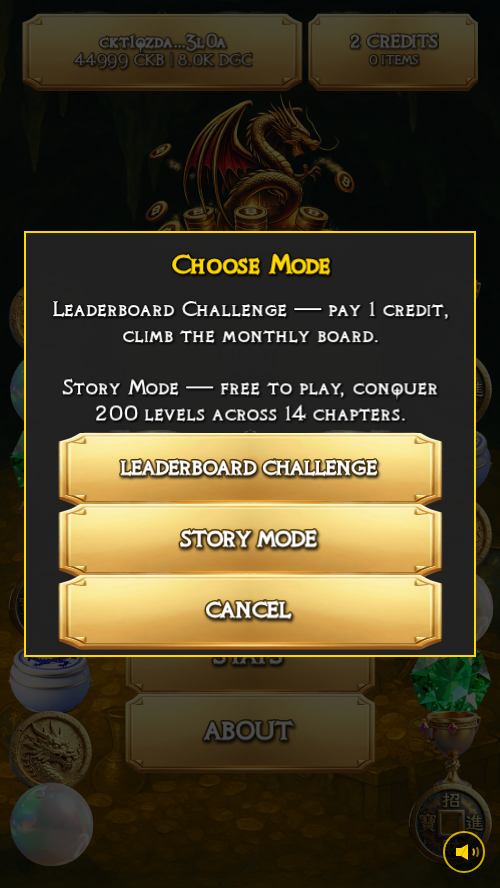
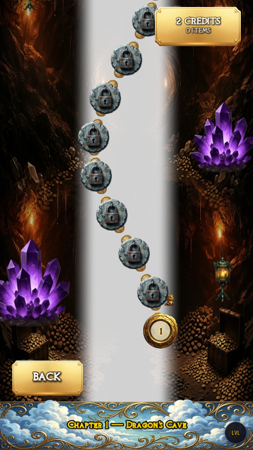
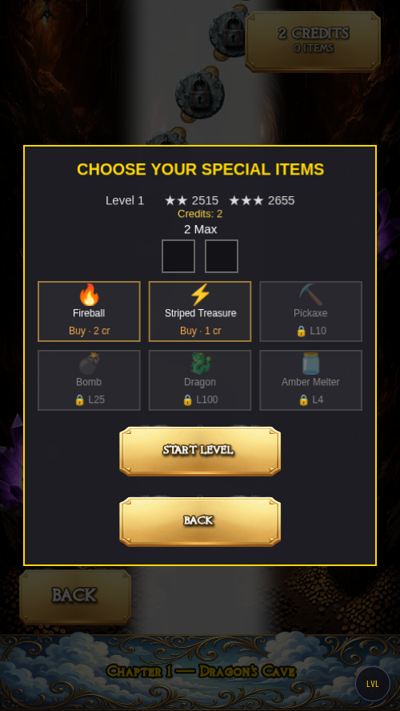
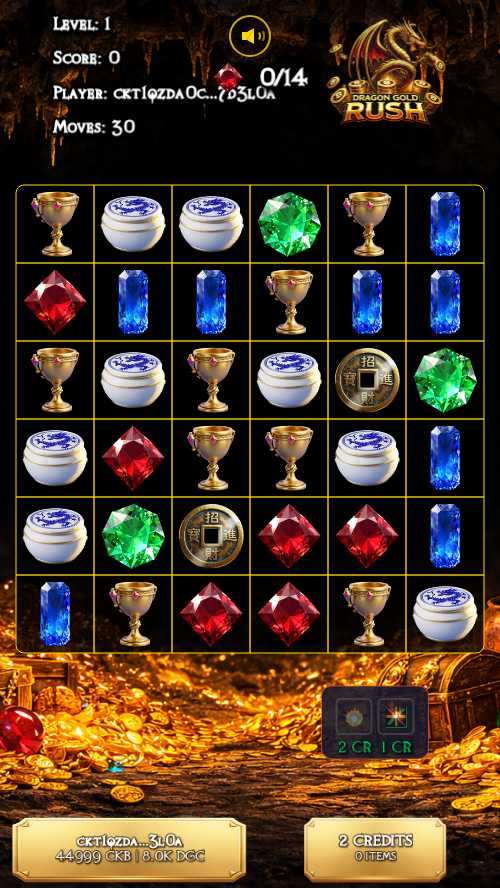

# How to Play Story Mode

Story Mode is Dragon Gold Rush's single-player adventure: 200 hand-crafted
levels across 14 themed chapters, each with its own look and music. Play free,
earn stars, and climb the map at your own pace.

### 1. Press PLAY and choose Story Mode

From the title screen press **PLAY** (first-time players accept the beta terms
once), then choose **STORY MODE**.

### 2. Pick a level on the map

The story map shows your journey: completed levels with their star ratings,
your next level on the path, and future chapters waiting under the clouds.
Tap the furthest glowing level to continue.

### 3. Choose your items (optional)

Before the level starts you can bring special items — fireballs and striped
treasures from the shop. You can use **up to two items per attempt**, so a
tough level never becomes pay-to-win. Press **START LEVEL** when ready.

### 4. Match three to win

Swap neighbouring treasures to line up three or more of a kind. Collect the
level's target treasures before your moves run out. Matching four or more
creates special treasures with powerful effects — experiment!

### 5. Earn stars and keep going

Finishing a level earns up to three stars based on your score. Clearing it
unlocks the next one on the map. Your progress and stars are saved to your
wallet, so you can continue on any device just by connecting.

## Good to know

- **Story Mode is free to play.** Items are optional and bought with credits;
  the two-item cap keeps every level beatable on skill.
- **Each chapter has its own theme and music** — 14 chapters, with a special
  five-level finale.
- **Monthly leaderboard, separate mode:** if you want to compete for prizes,
  the Leaderboard Challenge runs alongside Story Mode with a rotating level
  pool every month.
