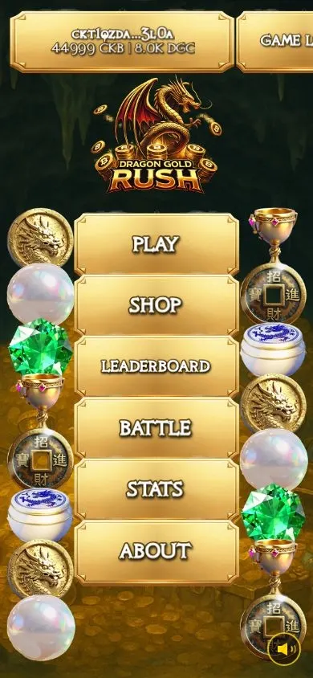
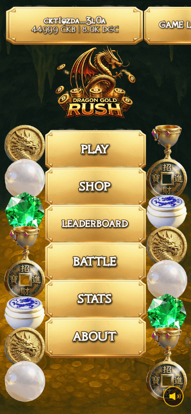
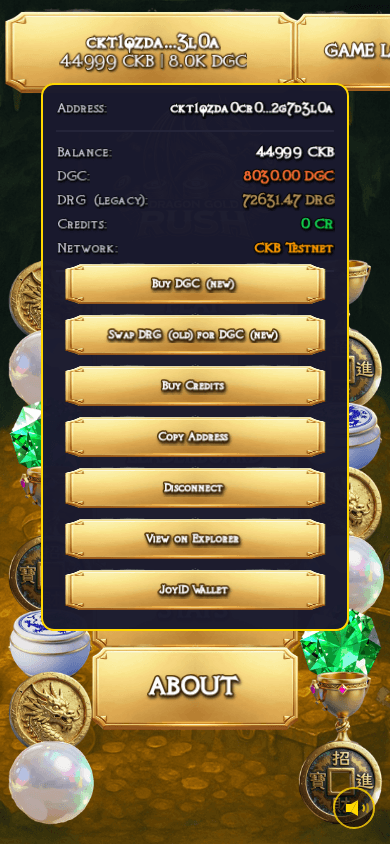
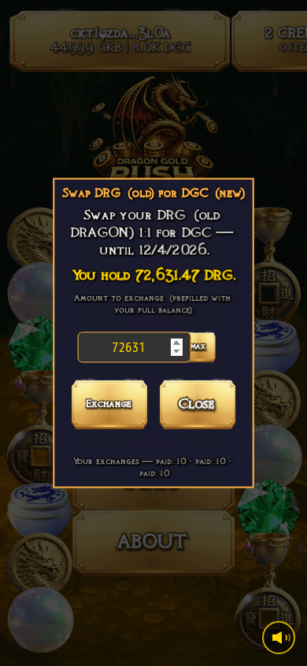
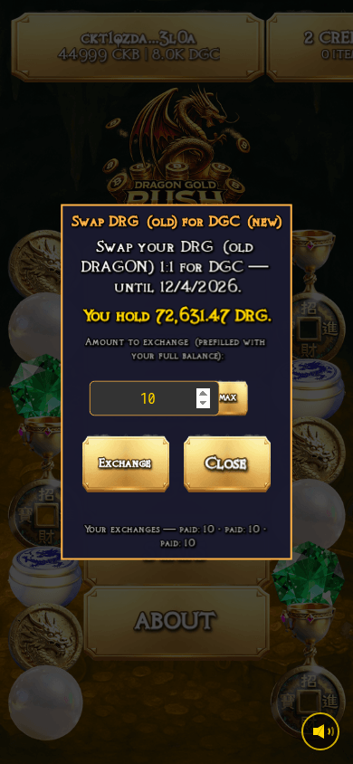
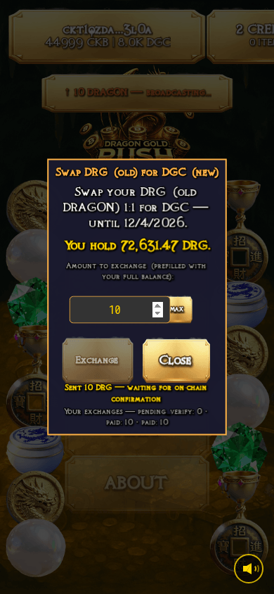

# How to Swap Your Old DRAGON Coins (DRG) for the New Coin (DGC)

{: .warning }
> The swap desk opens with the launch of the new coin. This guide shows the
> exact flow, captured from the live test build. *(Delete this note at
> launch.)*

{: .illustration }

Dragon Gold Rush is moving to a new game coin, **DGC**. If you hold the old
DRAGON coin (shown as **DRG** in the game), you can swap it **1-for-1** for
DGC — every 1 DRG you swap becomes 1 DGC in your wallet. The old coins you
send in are permanently destroyed ("burned"), which anyone can verify on the
blockchain.

Two ways to swap: in the game with one tap, or by sending coins directly from
any wallet. Both end the same way — DGC arrives in your wallet automatically.

Here is the whole in-game flow in motion:

{: .game-shot }

## Option 1 — swap inside the game (recommended)

### 1. Open the game and connect your wallet

Go to [dragon.mememadness.xyz](https://dragon.mememadness.xyz/) and connect
the wallet that holds your DRG. Your balances appear on the wallet button.

{: .game-shot }

### 2. Open the wallet menu

Tap the wallet button. If you hold any old coins, you'll see a separate
**DRG (legacy)** balance line. Tap **Swap DRG (old) for DGC (new)**.

{: .game-shot }

### 3. Check the amount

The swap window opens with your **full swappable DRG balance already filled
in**. You can lower the number to swap only part, or tap **MAX** to restore
the full amount.

{: .game-shot }

### 4. Press Exchange and approve

Press **Exchange**, then approve the transaction in your wallet when it asks.
You pay only the tiny network fee — the usual CKB storage deposit comes
straight back to you as change.

{: .game-shot }

### 5. Wait — the rest is automatic

The window shows progress while the blockchain confirms your coins (a few
minutes). When your DGC arrives, the window tells you the amount and closes
itself. Nothing else to do.

{: .game-shot }

## Option 2 — send from any wallet, zero clicks

Prefer your own wallet app? Simply send your DRG to the game's published swap
address (announced when the desk opens). The desk watches the blockchain,
recognises your payment, and sends DGC back to the **same wallet that paid** —
no forms, no buttons.

## Good to know

- **Who can swap:** every wallet on the published holders list — a snapshot of
  everyone who held DRAGON when its old trading pool closed. Your listed
  amount is the most you can swap.
- **Only new payments count.** Coins sent before the snapshot was taken can
  never be counted again — this protects the swap from double-counting.
- **If anything can't be matched, you get your DRG back automatically.** The
  desk never keeps coins it can't pay for.

{: .note }
> **Wallet apps still say "DRAGON".** The old coin's on-chain name can't be
> changed; inside the game it's shown as DRG so the two coins are never
> confused.
